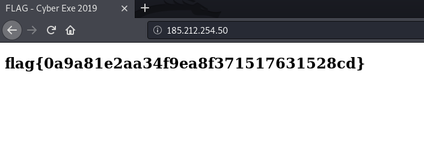

## მოცემულია GNU/Linux სერვერი. თქვენი მიზანია მოიპოვოთ წვდომა სერვერზე და მოიპოვოთ ე.წ. "flag"-ი.

1. nmap-ის გამოყენებით ვნახოთ რომელი პორტებია სერვერზე გახსნილი:
  ```bash
  nmap 185.212.254.50
  ```
  Output:
  ```bash
  Starting Nmap 7.80 ( https://nmap.org ) at 2020-05-24 06:38 EDT
  Nmap scan report for 185.212.254.50
  Host is up (0.011s latency).
  Not shown: 999 closed ports
  PORT   STATE SERVICE
  80/tcp open  http

  Nmap done: 1 IP address (1 host up) scanned in 1.76 seconds
  ```
  
2. როგორც ვხედავთ მე-80 პორტი გახსნილია, რომელიც http-ის default პორტია.

3. გავხსნათ ბრაუზერი და შევიდეთ ამ პორტზე

ბრაუზერიდან სერვერზე შესვლისთანავე პირდაპირ გვხვდება ფლეგი (რაცხა ნიტოა)
