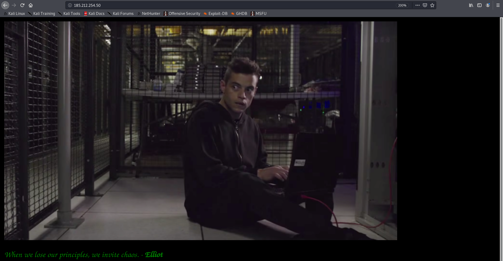

## მოცემულია სერვერი, რომელსაც ფლობს პიროვნება სახელად: Elliot. მან თქვენ გაგიმზადათ თავსატეხი, რომელიც უნდა ამოხსნათ და ამოიღოთ ე.წ. “flag”.

1. სერვერზე შესვლისას გვხვდებაშემდეგი საიტი. 
 


2. ვინაიდან მოცემული ფეიჯი არანაირ ინფორმაციას არ გვაძლევს, bruteforce-ით გადავუაროთ სახელებს და შევეცადოთ ვიპოვოთ ამ სერვერზე არსებული ფაილები თუ დირექტორიები.
ამისთვის გამოვიყენებთ ხელსაწყოს სახელად dirb:
    ```bash
    dirb <url_base> [<wordlist_file(s)>] [options]

    url_base - მისამართი რომელზეც გვინდა bruteforce (*)
    [<wordlist_file(s)>] - მისამართი ფაილზე, რომელიც შეიცავს სიტვებს. dirb გადაუყვება და ამ სიტყვების გამოყენებით შეეცდება იპოვოს დამალული მისამართი სერვერზე.
    [options] - სხვადასხვა ფლეგები (შეგიძლია დოკუმენტაციაში წაიკIთხოთ დეტალურად)
    ```
    გავუშვათ ბრძანება და ვნახოთ შედეგი:
    ```bash
    root@kali:~$ dirb http://185.212.254.50/ /usr/share/dirb/wordlists/big.txt 

    -----------------
    DIRB v2.22    
    By The Dark Raver
    -----------------

    START_TIME: Sat May 23 08:14:22 2020
    URL_BASE: http://185.212.254.50/
    WORDLIST_FILES: /usr/share/dirb/wordlists/big.txt

    -----------------

    GENERATED WORDS: 20458                                                         

    ---- Scanning URL: http://185.212.254.50/ ----
    ==> DIRECTORY: http://185.212.254.50/images/                                                                         
    + http://185.212.254.50/robots.txt (CODE:200|SIZE:33)                                                                
    + http://185.212.254.50/server-status (CODE:403|SIZE:302)                                                            
    ==> DIRECTORY: http://185.212.254.50/society/                                                                        
                                                                                                                        
    ---- Entering directory: http://185.212.254.50/images/ ----
    (!) WARNING: Directory IS LISTABLE. No need to scan it.                        
        (Use mode '-w' if you want to scan it anyway)
                                                                                                                        
    ---- Entering directory: http://185.212.254.50/society/ ----
                                                                                                                        
    -----------------
    END_TIME: Sat May 23 08:23:24 2020
    DOWNLOADED: 40916 - FOUND: 2

    ```

    გამოტანილი ინფორმაციიდან ვიგებთ, რომ dirb-მა იპოვა ორი ფოლდერი
    ```bash
    ==> DIRECTORY: http://185.212.254.50/images/                                
    ==> DIRECTORY: http://185.212.254.50/society/
    ```

    * /images/ ფოლდერში თU შევალთ ვნახავთ, რომ შეიცავს მხოლოდ ერთ ცალ სურათს (რომელიც მთავარ ფეიჯზე არის მოცემული), რაც ჩვენთვის საინტერესო არაა

3. /society მისამართზე გადასვლისას გვხვდება შემდეგი ფეიჯი 
    ამჯერადაც არაფერი საინტერესო, ჩავიხედოთ მიღებულ html-ში
    ```html
    <!doctype html>
    <html>
        <head>
            <title>Society</title>
        </head>
        <body style="background-color: black">
            
            <p style="color: green; font-family: cursive">Society? ...</p>

            <!--TODO list-->
            <!--1. Install PHP [+] -->
            <!--2. Create Virtual Host: cyber-cube.cb [+] -->
        </body>
    </html>
    ```
    Html-ში ვხედავთ TODO ლისტ-ს რომელში ორი ტასკია. მეორე ტასკის მიხედვით შეგვიძLია ვივარაუდოთ, რომ ამავე სერვერზე გაშვებულია ვირტუალური სერვერი(host) `cyber-cube.cb`

4. გამოვიყენოთ curl ბრძანება და შევიდეთ ამ აიპიზე და მოცემულ ვირტუალურ ჰოსტზე
    ```bash
    curl -H 'Host: cyber-cube.cb' 185.212.254.50 
    ```
    Output: 
    ```html
    <!DOCTYPE HTML PUBLIC "-//W3C//DTD HTML 3.2 Final//EN">
    <html>
    <head>
        <title>Index of /</title>
    </head>
    <body>
        <h1>Index of /</h1>
        <table>
            <tr><th valign="top"></th><th><a href="?C=N;O=D">Name</a></th><th><a href="?C=M;O=A">Last modified</a></th><th><a href="?C=S;O=A">Size</a></th><th><a href="?C=D;O=A">Description</a></th></tr>
            <tr><th colspan="5"><hr></th></tr>
            <tr><td valign="top"></td><td><a href="binary">binary</a></td><td align="right">2019-07-02 13:40  </td><td align="right"> 16K</td><td>&nbsp;</td></tr>
            <tr><th colspan="5"><hr></th></tr>
        </table>
        <address>Apache/2.4.29 (Ubuntu) Server at cyber-cube.cb Port 80</address>
    </body>
    </html>

    ```

    როგორც ვხედავთ ეს ფეიჯი განსხვავდება, იმისგან რასაც ბრაუზერში ვნახულობდით, ანუ მართლაც, რომ ვირტუალური ჰოსტმა დაგვიბრუნა თავისი ინდექს ფეიჯი (ამას გვიმოწმებ `<adresss>` თეგიც) 

5. შეგვიძლია ამ ჰოსტზეც გავუშვათ bruteforce, მაგრამ მანამდე შეგვიძლია ვნახოთ ამ html-დანვე თუ რა მისამართებზე შეგვიძLია გადასვლა(ამოვიღოთ src და href ოფშენები)
    ```
    src="/icons/blank.gif"
    src="/icons/unknown.gif"

    href="?C=N;O=D"
    href="?C=M;O=A"
    href="?C=S;O=A"
    href="?C=D;O=A"
    href="binary"
    ```

6. ზემოთ ჩამოთვლილი მისამართებიდან ყველაზე საინტერესო არის ბოლო 'binary'. ამიტომ მოვითხოვოთ /binary ფაილი და შევინახოთ ფაილში სახელად bin (--output პარამეტრად გადაეცემა შესანახი ფაილის მისამართI)
    ```bash
    curl -H 'Host: cyber-cube.cb' 185.212.254.50/binary --output bin
    ```
    Output:
    ```bash
      % Total    % Received % Xferd  Average Speed   Time    Time     Time  Current
                                 Dload  Upload   Total   Spent    Left  Speed
        100 16608  100 16608    0     0   352k      0 --:--:-- --:--:-- --:--:--  352k
    ````

7. როგორც ვხედავთ ფაილი გადმოვწერეთ, გავხსნათ და ვნახოთ შიგთავსი cat კომანდით.
    ```bash
    cat bin
    ```
    სამწუხაროდ ფაილი არაა ტექსტური სახით, როგორც ჩანს ბინარული ფაილია. ხოლო თავში ვხედავთ რომ უწერია ELF (Executable and Linkable Format), ამით შეგვიძლია ვივარაუდოთ რომ ეს ფაილი არის executable და უნდა გავუშვათ.

    ფაილი რომ გავუშვათ უნდა შევუცვალოთ permision-ები(დავუმატოთ execute-ის permision), რომ ბაშმა გაუშვას. ამის გაკეთება შეგვიძლია შემდეგნაირად:
    ```bash
    chmod +x bin
    ```

8. ახლა კი შეგვიძლია, როგორც სხვა ნებისმიერი პროგრამა, ისე გავუშვათ ჩვენი bin ფაილი.
    ```bash
    ./bin
    ```
    Output:
    ```bash
    Cyber_Cube{2dee4a7d7d63c913fb38e6e6d5cf8177}
    ```

    **როგორც ვხედავთ ეს bin ფაილი შეიცავდა სწორედ იმ flag-ს რისთვისაც აქ შევიკრიბეთ!**